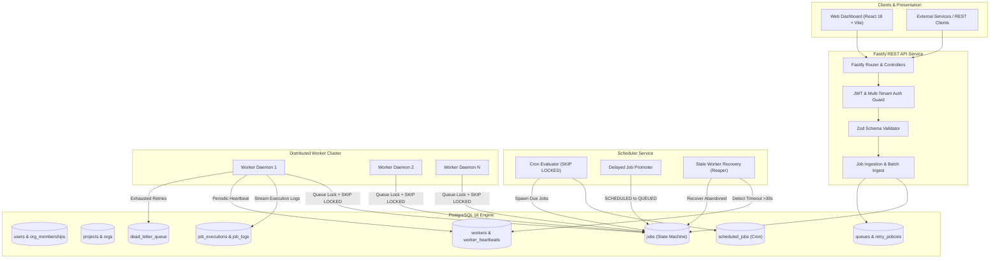
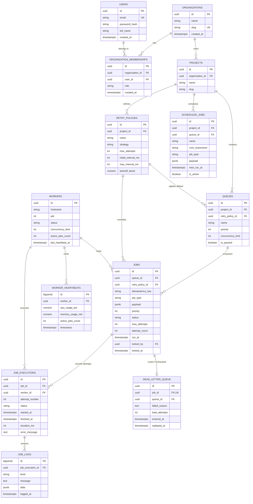

# Distributed Job Scheduler

A production-grade, highly available **Distributed Job Scheduler** built with **Fastify (Node.js 20 LTS)**, **PostgreSQL 16+**, **TypeScript**, and **React 18 (Vite + Tailwind CSS)**.

Designed with a database-centric architecture that guarantees:
* **Zero Duplicate Job Executions** under extreme race conditions.
* **Strict Queue Concurrency Limit Enforcement** via queue-level locking + `SELECT ... FOR UPDATE SKIP LOCKED`.
* **Automated Worker Failure Recovery** via background heartbeat reapers.
* **Comprehensive Auditability** with granular stdout/stderr execution logs and retry attempt histories.
* **Full-Featured Interactive Web Dashboard** for queue management, job inspection, worker monitoring, and DLQ replay.

---

## Architecture Diagram



---

## Entity-Relationship (ER) Diagram



---

## Core Features & Technical Highlights

### 1. Guaranteed Atomic Claiming & Queue Concurrency Invariant
To eliminate race conditions and enforce queue concurrency limits:
1. **Queue Row Locking**: Workers acquire an exclusive row-level lock on the target queue row (`SELECT ... FROM queues WHERE id = $1 FOR UPDATE`).
2. **Accurate In-Flight Slot Calculation**: Inside the queue transaction, the exact count of active in-flight jobs (`CLAIMED` / `RUNNING`) is computed.
3. **`SELECT ... FOR UPDATE SKIP LOCKED`**: Selects up to `min(capacity, available_slots)` jobs, marking them `CLAIMED`.
4. **Result**: Zero duplicate claims across workers, zero concurrency limit violations, and non-blocking parallel execution across different queues!

### 2. Full Job State Machine
* **Immediate Jobs**: `QUEUED` $\rightarrow$ `CLAIMED` $\rightarrow$ `RUNNING` $\rightarrow$ `COMPLETED`
* **Delayed / Scheduled Jobs**: `SCHEDULED` (with `run_at = target`) $\rightarrow$ promoted to `QUEUED` when `NOW() >= run_at`
* **Recurring Cron Jobs**: Cron definitions in `scheduled_jobs` evaluated by scheduler daemon, spawning concrete `QUEUED` instances atomically.
* **Batch Jobs**: Atomic multi-row `INSERT` inside a single SQL transaction.
* **Failure & Retries**: `RUNNING` $\rightarrow$ `FAILED` $\rightarrow$ `SCHEDULED` (with backoff delay) $\rightarrow$ `DEAD_LETTER` (DLQ upon attempt exhaustion).

### 3. Retry Strategies & Dead Letter Queue (DLQ)
* **Fixed Delay**: $\text{Delay} = I$
* **Linear Backoff**: $\text{Delay} = \min(I \times a, M)$
* **Exponential Backoff**: $\text{Delay} = \min(I \times f^{(a - 1)}, M)$
* **Manual DLQ Replay**: `POST /api/v1/dlq/:id/retry` resets attempt count and moves terminal failed jobs back to `QUEUED`.

### 4. Worker Failure Recovery & Graceful Shutdown
* **Heartbeat Service**: Workers publish heartbeats every 5 seconds.
* **Reaper Daemon**: Automatically marks workers as `OFFLINE` if no heartbeat is received for >30s, and recovers orphaned `CLAIMED`/`RUNNING` jobs back to `QUEUED` or DLQ.
* **Graceful Drain**: Workers trap `SIGTERM`/`SIGINT`, mark status `DRAINING`, and finish in-flight jobs before terminating.

---

## Quickstart & Setup Guide

### Option 1: Docker Compose (Single Command)

```bash
docker compose -f docker/docker-compose.yml up --build
```

Access:
* **Web Dashboard**: [http://localhost:3000](http://localhost:3000)
* **REST API & Swagger Docs**: [http://localhost:4000/docs](http://localhost:4000/docs)
* **Default Login**: `architect@test.com` / `Password123!`

---

### Option 2: Local Development

#### 1. Install Dependencies
```bash
npm install
npm --prefix src/frontend install
```

#### 2. Run Database Migrations
```bash
npm run migrate
```

#### 3. Start Services
Open 4 terminal windows:
```bash
# Terminal 1: Fastify REST API
npm run dev:api

# Terminal 2: Distributed Worker Daemon
npm run dev:worker

# Terminal 3: Scheduler & Reaper Daemon
npm run dev:scheduler

# Terminal 4: Vite React Dashboard
npm run dev:frontend
```

---

## Bonus Features

All 8 bonus features are implemented with real, tested backend logic (see `tests/integration/bonus-features.test.ts` for 11 passing tests covering every one of them).

| Feature | Where | How it works |
| :--- | :--- | :--- |
| **Rate limiting** | `api/server.ts`, `@fastify/rate-limit` | Global limit (default 300 req/min) plus a tighter per-route limit (10 req/min) on `/auth/login` and `/auth/register` to slow down credential stuffing. Returns `429` with `{code: "RATE_LIMITED"}`. |
| **RBAC** | `api/middleware/rbac.middleware.ts` | Roles (`VIEWER < MEMBER < ADMIN`) come from `organization_memberships` and are embedded in the JWT. `requireRole()` guards queue pause/resume/delete, retry-policy management, and DLQ replay/purge. Every privileged action is written to `audit_log`. |
| **WebSocket live updates** | `api/websocket.ts`, `core/events/event-bus.ts` | Clients connect to `ws://<host>/ws` and receive a JSON event (`JOB_CREATED`, `JOB_UPDATED`, `QUEUE_UPDATED`, `WORKER_UPDATED`, `DLQ_UPDATED`) the instant that mutation happens anywhere in the system — no polling needed. |
| **Distributed locking** | `core/services/lock.service.ts` | Uses real Postgres session-level advisory locks (`pg_try_advisory_lock`) — cluster-wide mutual exclusion with zero extra tables and automatic release if a process dies. Used to make the reaper sweep leader-elected across multiple scheduler instances. |
| **Workflow / DAG dependencies** | `core/services/workflow.service.ts` | A job created with `dependsOn: [jobId, ...]` starts in a new `WAITING` status and is excluded from claiming until every parent reaches `COMPLETED`, at which point it's promoted to `QUEUED` immediately (plus a scheduler-tick safety net for missed promotions). |
| **AI-generated failure summaries** | `core/services/ai-summary.service.ts` | When a job exhausts retries and lands in the DLQ, a short root-cause summary is generated — via the Claude API if `ANTHROPIC_API_KEY` is set, otherwise a deterministic rule-based summarizer that pattern-matches common failure classes (timeout, connection refused, auth, constraint violation). Works out of the box with zero configuration. |
| **Queue sharding** | `core/services/worker.service.ts` | A queue with `shard_count > 1` has its claimable jobs hash-partitioned (`MOD(ABS(hashtext(id)), shard_count)`), so independent worker pools can each own a disjoint shard and scale claim throughput horizontally without contending on the same rows. |
| **Event-driven execution** | `core/services/webhook.service.ts` | External systems register a webhook trigger and `POST` to `/api/v1/webhooks/:triggerId/fire` with an HMAC-SHA256 signature (`X-Webhook-Signature`) to enqueue a job the instant an event occurs, bypassing the poll interval entirely. |

---

## Automated Test Suites

The test suite includes comprehensive unit, integration, high-concurrency race condition, and bonus-feature tests — **38 tests, all passing**:

```bash
# Run all tests
npm test

# Run concurrency tests
npm run test:concurrency

# Run unit tests
npm run test:unit

# Run integration tests (includes tests/integration/bonus-features.test.ts)
npm run test:integration
```

### Concurrency Verification Matrix
* **Test A**: 2 workers competing for 1 job $\rightarrow$ exactly 1 claims it.
* **Test B**: 10 workers competing for 30 jobs $\rightarrow$ exactly 30 claims, 0 duplicates, 100% completion.
* **Test C**: Queue concurrency limit $= N$ strictly invariant under load.
* **Test D**: Worker crash / killed worker $\rightarrow$ Reaper recovers orphaned jobs.
* **Test E**: Multi-scheduler concurrency $\rightarrow$ zero duplicate recurring cron triggers.
* **Test F** (bonus): Distributed lock allows exactly one holder at a time and always releases.
* **Test G** (bonus): Sharded queue partitions claims across shard boundaries with no overlap.

---

## REST API Overview

| Group | Method | Endpoint | Description |
| :--- | :--- | :--- | :--- |
| **Auth** | `POST` | `/api/v1/auth/register` | Register user & organization |
| | `POST` | `/api/v1/auth/login` | Login and receive JWT |
| | `GET` | `/api/v1/auth/me` | Current user profile |
| **Queues** | `GET` | `/api/v1/projects/:projectId/queues` | List queues with real-time statistics |
| | `POST` | `/api/v1/projects/:projectId/queues` | Create queue (priority, concurrency limit, shard count) — MEMBER+ |
| | `PATCH` | `/api/v1/queues/:queueId` | Update queue configuration — MEMBER+ |
| | `POST` | `/api/v1/queues/:queueId/pause` | Pause queue execution — ADMIN only |
| | `POST` | `/api/v1/queues/:queueId/resume` | Resume queue execution — ADMIN only |
| | `DELETE` | `/api/v1/queues/:queueId` | Delete queue — ADMIN only |
| **Jobs** | `POST` | `/api/v1/queues/:queueId/jobs` | Enqueue immediate, delayed, scheduled, or DAG-dependent job |
| | `POST` | `/api/v1/queues/:queueId/jobs/batch` | Atomic bulk enqueue |
| | `GET` | `/api/v1/queues/:queueId/jobs` | Filtered & paginated job explorer |
| | `GET` | `/api/v1/jobs/:jobId` | Get job details, payload & executions |
| | `GET` | `/api/v1/jobs/:jobId/dependencies` | Job's DAG dependency graph (bonus) |
| | `POST` | `/api/v1/jobs/:jobId/cancel` | Cancel pending job |
| **Cron** | `GET` | `/api/v1/projects/:projectId/scheduled-jobs` | List recurring cron jobs |
| | `POST` | `/api/v1/projects/:projectId/scheduled-jobs` | Create recurring cron schedule |
| **DLQ** | `GET` | `/api/v1/dlq` | List dead letter queue entries (includes AI summary) |
| | `POST` | `/api/v1/dlq/:id/retry` | Replay dead-lettered job — MEMBER+ |
| | `DELETE` | `/api/v1/dlq/:id` | Purge DLQ entry — ADMIN only |
| | `POST` | `/api/v1/dlq/:id/summarize` | Regenerate AI failure summary (bonus) |
| **Webhooks** | `POST` | `/api/v1/projects/:projectId/webhooks` | Register an event-driven trigger (bonus) — MEMBER+ |
| | `POST` | `/api/v1/webhooks/:triggerId/fire` | Fire a trigger (HMAC-signed, public) — enqueues instantly |
| **Locks** | `GET` | `/api/v1/locks` | View active distributed locks (bonus) — ADMIN only |
| **Workers** | `GET` | `/api/v1/workers` | Active workers & heartbeat health |
| **Metrics** | `GET` | `/api/v1/metrics/system` | System-wide counts and throughput |
| **Live** | `WS` | `/ws` | WebSocket live updates (bonus) |

---

## Design Decisions & Trade-Offs

| Decision Area | Chosen Approach | Alternative Considered | Rationale & Trade-off |
| :--- | :--- | :--- | :--- |
| **Queue Storage Engine** | **PostgreSQL 16 (`SKIP LOCKED`)** | Redis (BullMQ) or RabbitMQ | Strict ACID consistency, single source of truth, transactional job enqueuing, and rich relational queries. |
| **Worker Concurrency** | **Async Promise Pool / Mutex** | OS Child Process per Job | Extremely lightweight memory footprint (~40MB per worker) with non-blocking I/O. |
| **Cron Scheduling** | **Precalculated `next_run_at` in DB** | Stateless In-Memory Timers | Survives application restarts; multi-scheduler coordination via `SKIP LOCKED`. |
| **Heartbeat & Reaper** | **DB Table + Periodic Sweep** | ZooKeeper / Consul Cluster | Eliminates external infrastructure dependencies while ensuring fault recovery. |
